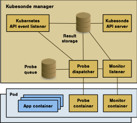

[](https://app.netlify.com/sites/testksonde/deploys)


# Kubesonde

Kubesonde is a tool to probe and test network security policies in Kubernetes.

:warning: Check out our paper on FSE-3023 [Analyzing Microservice Connectivity with Kubesonde](https://dl.acm.org/doi/10.1145/3611643.3613899)



## Structure of the project
Folders are organized as follows: 
- `crd`: backend service and kubesonde CRD 
- `docs`: documentation of the project/ideas.
- `frontend`: contains the UI for analyzing the probe outputs
- `examples`: sample output from Kubesonde

## Prerequisite: Clone the Repository

Before applying Kubesonde, you need to clone the repository, as the required configuration files (`kubesonde.yaml`, etc.) are located in the root of the repository:

```bash
git clone https://github.com/kubesonde/kubesonde.git
cd kubesonde
```

This ensures that you have all the necessary files and configurations for setting up Kubesonde.

## Run Kubesonde
### 1. Start the Kubernetes engine

You can run Kubernetes on the cloud, bare-metal or via Minikube or Kind.
### 2. Install the app to test

Install the application you want to test (e.g., `helm install wordpress bitnami/wordpress`). Make sure that the app is running with no errors.

### 3. Install Kubesonde

To install kubesonde run `kubectl apply -f kubesonde.yaml`. This creates all the required resources to run Kubesonde on your cluster. After that, you can install a scanner object for Kubesonde. The following is a Kubesonde object example that targets the default namespace: 
```yaml
apiVersion: security.kubesonde.io/v1
kind: Kubesonde
metadata:
  name: kubesonde-sample
spec:
  namespace: default
  probe: all
```
You can save it in a file `probe.yaml` and then apply it with `kubectl apply -f probe.yaml`
### 4. Fetching the results

To fetch the results, you need to use the following commands:

`kubectl --namespace kubesonde port-forward deployment.apps/kubesonde-controller-manager 2709`. This command creates a port mapping between your local computer and the Kubesonde deployment.

`curl localhost:2709/probes > <output-file>.json`. This command gets the probe result and stores it in an output file.

:warning: If you try to get the results of the probe just after applying it in the cluster the results may be empty or incomplete. Wait a few minutes (depending on the amount of pods) to get better results.
### 5. View results

Navigate to the [kubesonde website](https://kubesonde.jackops.dev) and upload the generated file to see the results.


## Deleting Kubesonde Resources

To delete the resources created by Kubesonde, use the following commands:

1. Delete the Kubesonde scanner object:

```bash
kubectl delete -f probe.yaml
```

2. Delete the Kubesonde deployment and associated resources:

```bash
kubectl delete -f kubesonde.yaml
```

This will remove all resources created by Kubesonde from your cluster.
 


## Contributing

Contributions to the project are welcome. Create a PR and let's discuss the changes.
## Credits

Logo from [Elisabetta Russo](stelladigitale.it) info@stelladigitale.it
