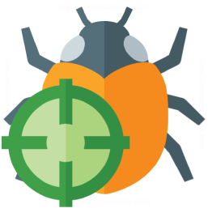
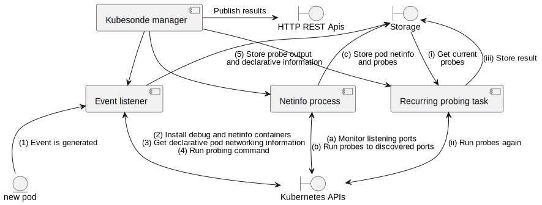

# Kubesonde

Kubesonde is a tool to probe and test network security policies in a Kubernetes cluster.

A common problem when enabling security policies in cloud environments is to verify their correctness
and to avoid any misconfiguration. This task becomes even more complex when the amount of rules increases
and when load-balancing effects can cause dynamic changes in the infrastructure. Another scenario is when
multi-tenancy is enabled in cloud environments. 
 
kubesonde leverages Kubernetes APIs to probe the container rules and access policies.

## Structure of the project
Folders are organised as follows: 
- `crd`: backend service and kubesonde CRD 
- `docs`: documentation of the project/ideas.
- `frontend`: contains the UI for analysing the probe outputs
- `examples`: sample output from Kubesonde

## Development tools

To create a k8s cluster, the recommended option is Minikube
 
 `minikube start`

Alternatively one can use [kind](https://github.com/kubernetes-sigs/kind).

`kind create cluster --image kindest/node:v1.16.5`

There is an already-made recipe to run the whole stack: 
`make run-test-env`

> Note: 
> If you are planning to use another Kubernetes implementation, please take a look
> at the features that need to be added when creating the api client.

### Additional tools used

- [debug containers](https://kubernetes.io/docs/tasks/debug-application-cluster/debug-running-pod/)
- [kubebuilder apis](https://github.com/weaveworks/cluster-api-provider-existinginfra/blob/master/main.go) to connect
with controller and govern the cluster.

## Tests

Every folder containing code has its own README.md and test suites.

## Roadmap

Features to be implemented: 

- Make kubesonde extendable

## LEGACY - Project bootstrapping
The project was bootstrapped with [kubebuilder](https://book.kubebuilder.io/). This is also a
good place where to understand how to build plugins.

I used the commands:
 - `kubebuilder init --domain kubesonde.io`
 - `kubebuilder create api --group security --version v1 --kind kubesonde`
 